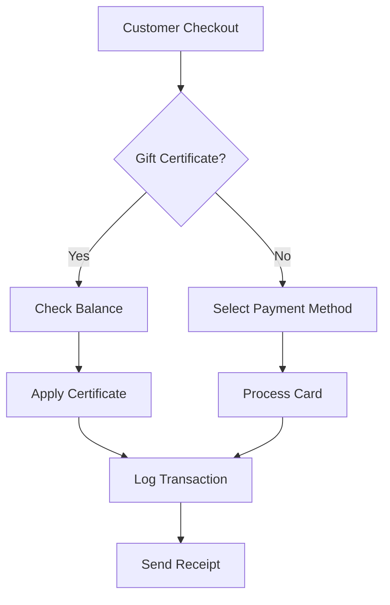

# Product Requirements Document (PRD)
## SalonBase MVP - Simple, Reliable Salon Management Software

### Document Information
- **Version:** 1.0
- **Date:** October 2025
- **Author:** Product Team
- **Status:** Draft
- **Target Launch:** January 2026 (8-week build)

---

## 1. Executive Summary

### Problem Statement
Current salon management platforms like Fresha suffer from:
- **Payment processing errors** causing incorrect charges to credit cards instead of gift certificates
- **Mobile payment failures** requiring multiple attempts for membership signups
- **Hidden marketplace fees** charging 20% commission without clear disclosure
- **Poor customer support** with unresolved billing disputes
- **Data lock-in** making it difficult to switch platforms

### Solution
SalonBase is a streamlined salon management platform that prioritizes reliability and transparency. Built as a single Next.js application, it focuses exclusively on core booking and payment features without marketplace complications.

### Success Metrics
- **Payment error rate:** < 0.1%
- **Mobile booking completion rate:** > 95%
- **Customer support response time:** < 2 hours
- **Data migration success rate:** 100%
- **Monthly churn rate:** < 5%

---

## 2. User Personas

### Primary: Salon Owner (Anu)
- **Role:** Owner of small-to-medium salon (2-10 staff)
- **Pain Points:** Losing money to payment errors, surprise fees, poor support
- **Needs:** Reliable payment processing, transparent pricing, easy data migration
- **Technical Skill:** Basic to intermediate

### Secondary: Salon Staff
- **Role:** Service providers using the system daily
- **Pain Points:** Complicated interfaces, slow systems during peak hours
- **Needs:** Quick appointment booking, easy payment processing
- **Technical Skill:** Basic

### Tertiary: Salon Customers
- **Role:** End users booking appointments
- **Pain Points:** Payment failures on mobile, lost gift certificates
- **Needs:** Smooth booking experience, reliable payment processing
- **Technical Skill:** Varies widely

---

## 3. Core Features (MVP)

### 3.1 Appointment Management

#### Basic Scheduling
```
User Story: As a staff member, I can create, edit, and cancel appointments
Acceptance Criteria:
- Create appointment in < 3 clicks
- View daily/weekly calendar
- Automatic conflict detection
- SMS/email confirmation to clients
```

#### Service Catalog
```
User Story: As an owner, I can manage services and pricing
Acceptance Criteria:
- Add/edit services with duration and price
- Assign services to specific staff
- Set blocked times for breaks/lunch
```

### 3.2 Payment Processing

#### Secure Payment Flow
```
User Story: As a customer, I can pay without errors or double charges
Acceptance Criteria:
- Single payment attempt with clear status
- Automatic rollback on failures
- Payment source clearly shown before charging
- Receipt automatically emailed
```

#### Gift Certificate System
```
User Story: As a staff member, I can issue and redeem gift certificates
Acceptance Criteria:
- Generate unique certificate codes
- Track balance and history
- PREVENT accidental credit card charges
- Show remaining balance after use
```

**Critical Implementation Detail:**
```typescript
// Payment source hierarchy (ENFORCED)
1. Check for gift certificate first
2. Show explicit payment source selection
3. Require confirmation for credit card charges
4. Log every payment decision for audit
```

### 3.3 Membership Management

#### Membership Signup (Mobile-Optimized)
```
User Story: As a customer, I can sign up for membership on my phone
Acceptance Criteria:
- Works on iOS/Android browsers
- Saves progress if interrupted
- Maximum 2 retry attempts needed
- Clear error messages
- Fallback to simple card form if needed
```

### 3.4 Client Management

#### Client Database
```
User Story: As an owner, I can manage all client information
Acceptance Criteria:
- Store client contact info and preferences
- View appointment history
- Track total spend and frequency
- Add notes for staff
```

### 3.5 Data Migration

#### Import Tool
```
User Story: As a new user, I can import my data from Fresha
Acceptance Criteria:
- CSV/Excel upload with preview
- Validation before import
- Deduplication of clients
- Progress indicator
- Rollback option if needed
```

---

## 4. Technical Architecture

### 4.1 Technology Stack
```yaml
Framework: Next.js 15 (App Router)
Language: TypeScript
Database: Neon (Serverless Postgres)
ORM: Prisma
Cache: Upstash Redis
Payments: Stripe
Background Jobs: Inngest
Monitoring: Sentry
Hosting: Vercel
```

### 4.2 Application Structure
```
Single Next.js Application:
- /app/dashboard/* - Staff interface (auth required)
- /app/book/* - Public booking widget
- /app/api/webhooks/* - Stripe webhook handlers
- /app/actions/* - Server Actions for mutations
```

### 4.3 Database Schema (Simplified)
```sql
Core Tables:
- users (id, email, role, salon_id)
- clients (id, name, email, phone, notes)
- appointments (id, client_id, staff_id, service_id, datetime, status)
- payments (id, appointment_id, amount, method, status)
- gift_certificates (id, code, balance, original_amount)
- payment_audit_log (ALL payment attempts logged)
```

### 4.4 Security Requirements
- **Authentication:** NextAuth.js with email/password
- **Authorization:** Role-based (owner, staff, client)
- **Payment Security:** PCI compliance via Stripe
- **Data Encryption:** TLS 1.3, encrypted at rest
- **Audit Logging:** Every payment action logged

---

## 5. User Interface Design

### 5.1 Design Principles
- **Clarity Over Cleverness:** Obvious UI, no hidden features
- **Mobile-First Booking:** Customer-facing pages optimized for phones
- **Desktop-First Dashboard:** Staff use computers primarily
- **Accessibility:** WCAG 2.1 AA compliance

### 5.2 Key Screens

#### Dashboard Home
```
Layout:
┌─────────────────────────────────┐
│ Today's Appointments        [+] │
├─────────────────────────────────┤
│ 9:00  Jane Doe - Haircut   $50 │
│ 10:00 John Smith - Color  $120 │
│ [Show payment source clearly]   │
└─────────────────────────────────┘
```

#### Payment Screen
```
Payment Source Selection (EXPLICIT):
┌─────────────────────────────────┐
│ Total Due: $50                  │
├─────────────────────────────────┤
│ ◉ Gift Certificate (Bal: $100) │
│ ○ Credit Card ending 4242      │
│ ○ New Payment Method           │
├─────────────────────────────────┤
│ [Confirm Payment]              │
└─────────────────────────────────┘
```

---

## 6. Implementation Plan

### Phase 1: Core Foundation (Weeks 1-2)
- [ ] Next.js setup with authentication
- [ ] Neon database setup and Prisma configuration
- [ ] Basic appointment CRUD
- [ ] Staff dashboard layout

### Phase 2: Payment System (Weeks 3-4)
- [ ] Stripe integration
- [ ] Gift certificate system
- [ ] Payment audit logging
- [ ] Receipt generation

### Phase 3: Client Features (Weeks 5-6)
- [ ] Public booking widget
- [ ] Mobile optimization
- [ ] Membership system
- [ ] Client portal

### Phase 4: Migration & Polish (Weeks 7-8)
- [ ] Data import tool
- [ ] Email/SMS notifications
- [ ] Error handling improvements
- [ ] Performance optimization

---

## 7. Success Criteria

### Launch Requirements (Must Have)
- ✅ Zero payment processing errors in testing
- ✅ Mobile booking works on iOS/Android
- ✅ Gift certificates never charge wrong source
- ✅ Data import from CSV
- ✅ Under 500ms response time

### Post-Launch Success Metrics (Week 4)
- 10 active salons
- < 0.1% payment error rate
- > 95% mobile completion rate
- Zero data loss incidents
- < 2 hour support response

---

## 8. Risks & Mitigations

### Technical Risks
| Risk | Probability | Impact | Mitigation |
|------|------------|--------|------------|
| Payment processing bugs | Medium | High | Extensive testing, audit logs |
| Data migration errors | Medium | High | Preview mode, rollback capability |
| Mobile browser issues | High | Medium | Progressive enhancement, fallbacks |

### Business Risks
| Risk | Probability | Impact | Mitigation |
|------|------------|--------|------------|
| Slow adoption | Medium | High | Free migration service |
| Fresha retaliation | Low | Medium | Focus on underserved segments |
| Support overwhelm | Medium | Medium | Excellent documentation, video guides |

---

## 9. Out of Scope (Not in MVP)

- ❌ Marketplace/discovery features
- ❌ Inventory management
- ❌ Advanced analytics/reporting
- ❌ Multi-location support
- ❌ Custom mobile apps
- ❌ POS system integration
- ❌ Email marketing tools
- ❌ Loyalty programs (beyond basic memberships)

---

## 10. Pricing Strategy

### Simple, Transparent Pricing
```
Base Plan:
- $5 per staff member per month
- 2.5% + $0.30 per transaction (Stripe pass-through)
- NO setup fees
- NO marketplace fees
- NO hidden charges

Pioneer Discount:
- First 50 customers: $3 per staff member
- Locked in for 12 months
```

---

## 11. Launch Strategy

### Week 1: Soft Launch
- 5 beta salons (personal network)
- Daily check-ins
- Rapid bug fixes

### Week 2-4: Controlled Growth
- 25 salons target
- Focus on migration success
- Collect testimonials

### Month 2: Public Launch
- ProductHunt launch
- Direct outreach to Fresha users
- Referral program activation

---

## 12. Appendix

### A. Payment Flow Diagram


### B. Migration Checklist
- [ ] Export data from Fresha
- [ ] Validate CSV format
- [ ] Run import preview
- [ ] Check for duplicates
- [ ] Confirm client count
- [ ] Execute import
- [ ] Verify in dashboard

### C. Contact
- **Product Owner:** [Email]
- **Technical Lead:** [Email]
- **Design Lead:** [Email]

---

*This document represents the Minimum Viable Product. Features will be added based on user feedback and business priorities.*